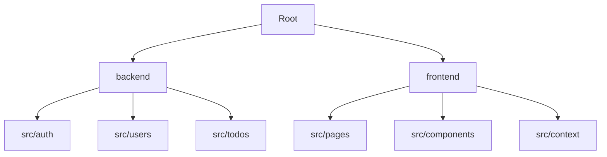

Todo Management

A premium, full-stack Todo Management Application designed for efficiency and modern aesthetics. Built with a high-end **Glassmorphism** design system, robust authentication, and role-based access control.


## Core Features

###  Stunning Visuals
- **Premium UI Overhaul**: Complete glassmorphism-based design with vibrant gradients and smooth micro-animations.
- **Modern Typography**: Powered by **Inter** for exceptional readability.
- **Dynamic Interactions**: Polished buttons, input fields, and hover states.

### Secure Architecture
- **JWT Authentication**: Secure login and signup flow.
- **Role-Based Access Control (RBAC)**: Distinct permissions for `USER` and `ADMIN` roles.
- **Soft Delete**: User accounts can be deactivated without immediate data loss.

### Functionality
- **Todo CRUD**: Full Create, Read, Update, and Delete operations for tasks.
- **Pagination**: Efficiently manage large task lists with built-in pagination.
- **Admin Dashboard**: Comprehensive control center for managing users, roles, and status with **inline editing**.
- **User Profiles**: Manage personal information and security settings.

## Technology Stack

### Frontend
- **React**: Modern component-based architecture.
- **Tailwind CSS**: Custom utility-based styling with glassmorphism tokens.
- **Lucide React**: Beautiful, consistent iconography.
- **TanStack Query (v5)**: Powerful server-state management and caching.
- **React Router**: Seamless client-side navigation.

### Backend
- **NestJS**: Scalable and maintainable Node.js framework.
- **TypeORM**: Robust database interaction layer.
- **Bcrypt**: Industrial-strength password hashing.
- **Passport.js**: Standardized authentication strategies.

## Getting Started

### Prerequisites
- Node.js (v18+)
- SQLite (default) or any compatible database

### Installation

1. **Clone the repository**
   ```bash
   git clone <repository-url>
   cd spatial-hawking
   ```

2. **Setup Backend**
   ```bash
   cd backend
   npm install
   npm run start:dev
   ```

3. **Setup Frontend**
   ```bash
   cd ../frontend
   npm install
   npm run dev
   ```

##  Project Structure



